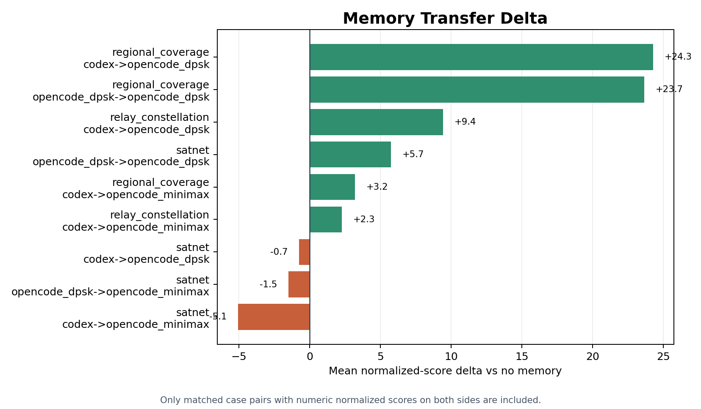
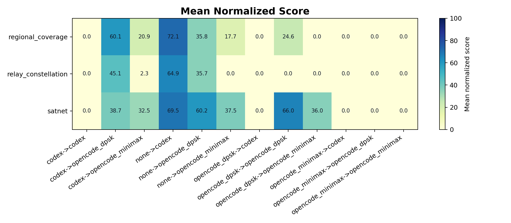
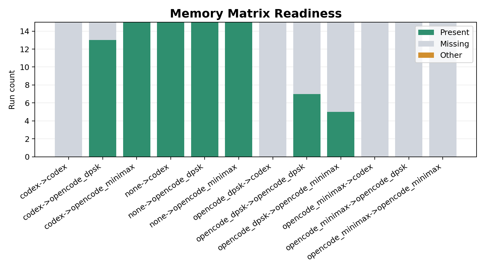

# Memory Accumulation

Cross-benchmark memory-accumulation results comparing accumulated memory against matched no-memory main-agentic runs.

Generated from the current `memory_accumulation` aggregate artifacts.

## Figures

## Matrix Readiness

| Memory Source | Harness | Expected | Present | Missing | Valid | Mean Score | Overall Statuses |
| --- | --- | ---: | ---: | ---: | ---: | ---: | ---: |
| codex | codex | 15 | 0 | 15 | 0 | 0.0000 | missing_artifact: 15 |
| codex | opencode_dpsk | 15 | 13 | 2 | 13 | 47.97 | missing_artifact: 2, success: 13 |
| codex | opencode_minimax | 15 | 15 | 0 | 15 | 18.56 | success: 15 |
| none | codex | 15 | 15 | 0 | 15 | 68.82 | success: 15 |
| none | opencode_dpsk | 15 | 15 | 0 | 15 | 43.90 | success: 15 |
| none | opencode_minimax | 15 | 15 | 0 | 13 | 18.42 | success: 13, verifier_invalid: 2 |
| opencode_dpsk | codex | 15 | 0 | 15 | 0 | 0.0000 | missing_artifact: 15 |
| opencode_dpsk | opencode_dpsk | 15 | 7 | 8 | 7 | 30.20 | missing_artifact: 8, success: 7 |
| opencode_dpsk | opencode_minimax | 15 | 5 | 10 | 4 | 12.01 | missing_artifact: 10, success: 4, verifier_invalid: 1 |
| opencode_minimax | codex | 15 | 0 | 15 | 0 | 0.0000 | missing_artifact: 15 |
| opencode_minimax | opencode_dpsk | 15 | 0 | 15 | 0 | 0.0000 | missing_artifact: 15 |
| opencode_minimax | opencode_minimax | 15 | 0 | 15 | 0 | 0.0000 | missing_artifact: 15 |

## Best Demonstrations

| Benchmark | Memory Source | Harness | Pairs | No-Memory Mean | Memory Mean | Delta | Improved | Regressed |
| --- | --- | --- | ---: | ---: | ---: | ---: | ---: | ---: |
| regional_coverage | codex | opencode_dpsk | 5 | 35.79 | 60.08 | 24.28 | 4 | 1 |
| regional_coverage | opencode_dpsk | opencode_dpsk | 2 | 37.92 | 61.57 | 23.66 | 2 | 0 |
| relay_constellation | codex | opencode_dpsk | 5 | 35.67 | 45.09 | 9.4184 | 2 | 3 |
| satnet | opencode_dpsk | opencode_dpsk | 5 | 60.23 | 65.97 | 5.7422 | 3 | 2 |
| regional_coverage | codex | opencode_minimax | 5 | 17.73 | 20.94 | 3.2117 | 4 | 1 |
| relay_constellation | codex | opencode_minimax | 5 | 0.0000 | 2.2633 | 2.2633 | 1 | 0 |

## Regressions

| Benchmark | Memory Source | Harness | Pairs | No-Memory Mean | Memory Mean | Delta | Improved | Regressed |
| --- | --- | --- | ---: | ---: | ---: | ---: | ---: | ---: |
| satnet | codex | opencode_minimax | 5 | 37.54 | 32.46 | -5.0753 | 1 | 4 |
| satnet | opencode_dpsk | opencode_minimax | 5 | 37.54 | 36.03 | -1.5082 | 2 | 3 |
| satnet | codex | opencode_dpsk | 3 | 65.32 | 64.58 | -0.7386 | 1 | 2 |

## Aggregate Metadata

- Config: `experiments/memory_accumulation/configs/default.yaml`
- Rows: `180`
- Schema version: `1`
