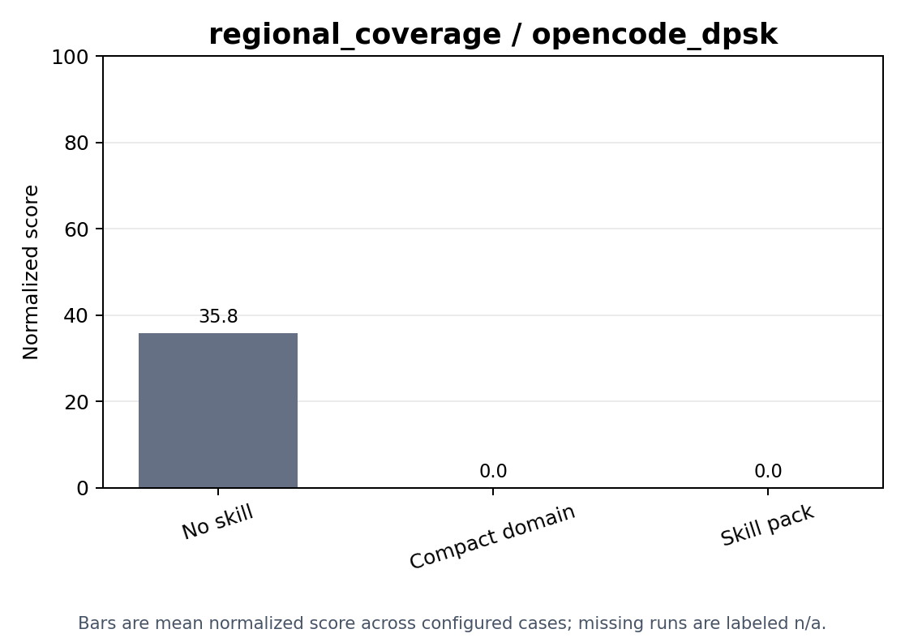
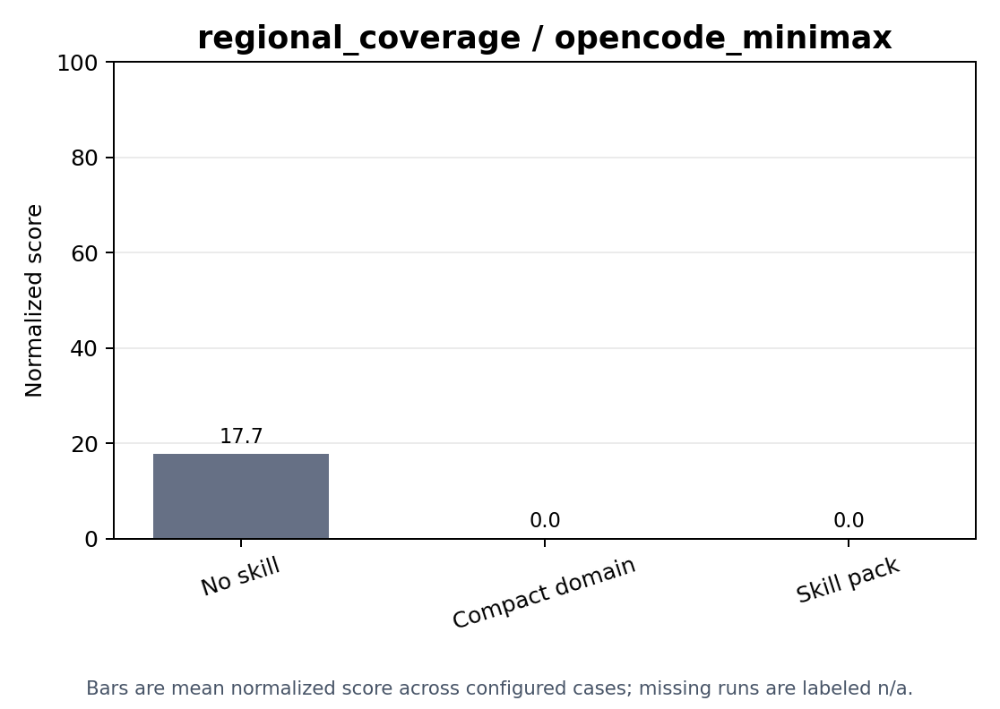

# Skill Injection

regional_coverage skill-ablation results across configured conditions and harnesses.

Generated from the current `skill_injection` aggregate artifacts.

## Score Plots

## Condition Summary

| Condition | Runs | Present | Valid | Valid Rate | Mean Weighted Coverage | Mean Coverage | Mean Actions | Mean Min Battery | Mean Score | Overall Statuses |
| --- | ---: | ---: | ---: | ---: | ---: | ---: | ---: | ---: | ---: | ---: |
| compact_domain | 10 | 0 | 0 | 0.0000 | - | - | - | - | 0.0000 | missing_artifact: 10 |
| no_skill | 10 | 10 | 10 | 1.0000 | 0.2203 | 0.2066 | 40.90 | 493.7 | 26.76 | success: 10 |
| skill_pack | 10 | 0 | 0 | 0.0000 | - | - | - | - | 0.0000 | missing_artifact: 10 |

## Condition And Harness Summary

| Condition | Harness | Runs | Present | Valid | Valid Rate | Mean Weighted Coverage | Mean Coverage | Mean Actions | Mean Min Battery | Mean Score | Overall Statuses |
| --- | --- | ---: | ---: | ---: | ---: | ---: | ---: | ---: | ---: | ---: | ---: |
| compact_domain | opencode_dpsk | 5 | 0 | 0 | 0.0000 | - | - | - | - | 0.0000 | missing_artifact: 5 |
| compact_domain | opencode_minimax | 5 | 0 | 0 | 0.0000 | - | - | - | - | 0.0000 | missing_artifact: 5 |
| no_skill | opencode_dpsk | 5 | 5 | 5 | 1.0000 | 0.3965 | 0.3744 | 54.20 | 492.1 | 35.79 | success: 5 |
| no_skill | opencode_minimax | 5 | 5 | 5 | 1.0000 | 0.0440 | 0.0388 | 27.60 | 495.3 | 17.73 | success: 5 |
| skill_pack | opencode_dpsk | 5 | 0 | 0 | 0.0000 | - | - | - | - | 0.0000 | missing_artifact: 5 |
| skill_pack | opencode_minimax | 5 | 0 | 0 | 0.0000 | - | - | - | - | 0.0000 | missing_artifact: 5 |

## Cases

| Condition | Harness | Split | Case | Artifact | Overall Status | Verifier Status | Valid | Duration (s) | Skills | Weighted Coverage | Coverage | Actions | Min Battery | Score |
| --- | --- | --- | --- | --- | --- | --- | --- | ---: | ---: | ---: | ---: | ---: | ---: | ---: |
| compact_domain | opencode_dpsk | test | case_0001 | missing_artifact | missing_artifact | missing_artifact | - | - | 1 | - | - | - | - | 0 |
| compact_domain | opencode_dpsk | test | case_0002 | missing_artifact | missing_artifact | missing_artifact | - | - | 1 | - | - | - | - | 0 |
| compact_domain | opencode_dpsk | test | case_0003 | missing_artifact | missing_artifact | missing_artifact | - | - | 1 | - | - | - | - | 0 |
| compact_domain | opencode_dpsk | test | case_0004 | missing_artifact | missing_artifact | missing_artifact | - | - | 1 | - | - | - | - | 0 |
| compact_domain | opencode_dpsk | test | case_0005 | missing_artifact | missing_artifact | missing_artifact | - | - | 1 | - | - | - | - | 0 |
| compact_domain | opencode_minimax | test | case_0001 | missing_artifact | missing_artifact | missing_artifact | - | - | 1 | - | - | - | - | 0 |
| compact_domain | opencode_minimax | test | case_0002 | missing_artifact | missing_artifact | missing_artifact | - | - | 1 | - | - | - | - | 0 |
| compact_domain | opencode_minimax | test | case_0003 | missing_artifact | missing_artifact | missing_artifact | - | - | 1 | - | - | - | - | 0 |
| compact_domain | opencode_minimax | test | case_0004 | missing_artifact | missing_artifact | missing_artifact | - | - | 1 | - | - | - | - | 0 |
| compact_domain | opencode_minimax | test | case_0005 | missing_artifact | missing_artifact | missing_artifact | - | - | 1 | - | - | - | - | 0 |
| no_skill | opencode_dpsk | test | case_0001 | present | success | valid | true | 7200.9 | 0 | 0.5923 | 0.5974 | 64 | 492.9 | 49.78 |
| no_skill | opencode_dpsk | test | case_0002 | present | success | valid | true | 7201.4 | 0 | 0.2691 | 0.2636 | 15 | 496.7 | 35.94 |
| no_skill | opencode_dpsk | test | case_0003 | present | success | valid | true | 4748.3 | 0 | 0.4890 | 0.4908 | 64 | 486.9 | 39.89 |
| no_skill | opencode_dpsk | test | case_0004 | present | success | valid | true | 7200.9 | 0 | 0.1235 | 0.1067 | 64 | 496.6 | 14.04 |
| no_skill | opencode_dpsk | test | case_0005 | present | success | valid | true | 3871.7 | 0 | 0.5087 | 0.4133 | 64 | 487.6 | 39.33 |
| no_skill | opencode_minimax | test | case_0001 | present | success | valid | true | 5679.6 | 0 | 0 | 0 | 0 | 492.9 | 23.21 |
| no_skill | opencode_minimax | test | case_0002 | present | success | valid | true | 2560.0 | 0 | 0.1697 | 0.1449 | 22 | 496.7 | 26.96 |
| no_skill | opencode_minimax | test | case_0003 | present | success | valid | true | 6216.6 | 0 | 0.0501 | 0.0490 | 3 | 493.1 | 23.47 |
| no_skill | opencode_minimax | test | case_0004 | present | success | valid | true | 5561.5 | 0 | 0 | 0 | 64 | 496.6 | 5.7295 |
| no_skill | opencode_minimax | test | case_0005 | present | success | valid | true | 2941.0 | 0 | 0 | 0 | 49 | 497.3 | 9.2533 |
| skill_pack | opencode_dpsk | test | case_0001 | missing_artifact | missing_artifact | missing_artifact | - | - | 4 | - | - | - | - | 0 |
| skill_pack | opencode_dpsk | test | case_0002 | missing_artifact | missing_artifact | missing_artifact | - | - | 4 | - | - | - | - | 0 |
| skill_pack | opencode_dpsk | test | case_0003 | missing_artifact | missing_artifact | missing_artifact | - | - | 4 | - | - | - | - | 0 |
| skill_pack | opencode_dpsk | test | case_0004 | missing_artifact | missing_artifact | missing_artifact | - | - | 4 | - | - | - | - | 0 |
| skill_pack | opencode_dpsk | test | case_0005 | missing_artifact | missing_artifact | missing_artifact | - | - | 4 | - | - | - | - | 0 |
| skill_pack | opencode_minimax | test | case_0001 | missing_artifact | missing_artifact | missing_artifact | - | - | 4 | - | - | - | - | 0 |
| skill_pack | opencode_minimax | test | case_0002 | missing_artifact | missing_artifact | missing_artifact | - | - | 4 | - | - | - | - | 0 |
| skill_pack | opencode_minimax | test | case_0003 | missing_artifact | missing_artifact | missing_artifact | - | - | 4 | - | - | - | - | 0 |
| skill_pack | opencode_minimax | test | case_0004 | missing_artifact | missing_artifact | missing_artifact | - | - | 4 | - | - | - | - | 0 |
| skill_pack | opencode_minimax | test | case_0005 | missing_artifact | missing_artifact | missing_artifact | - | - | 4 | - | - | - | - | 0 |
