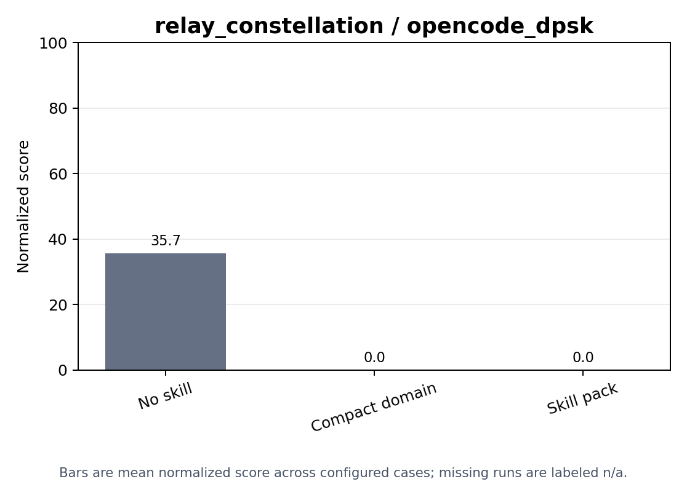
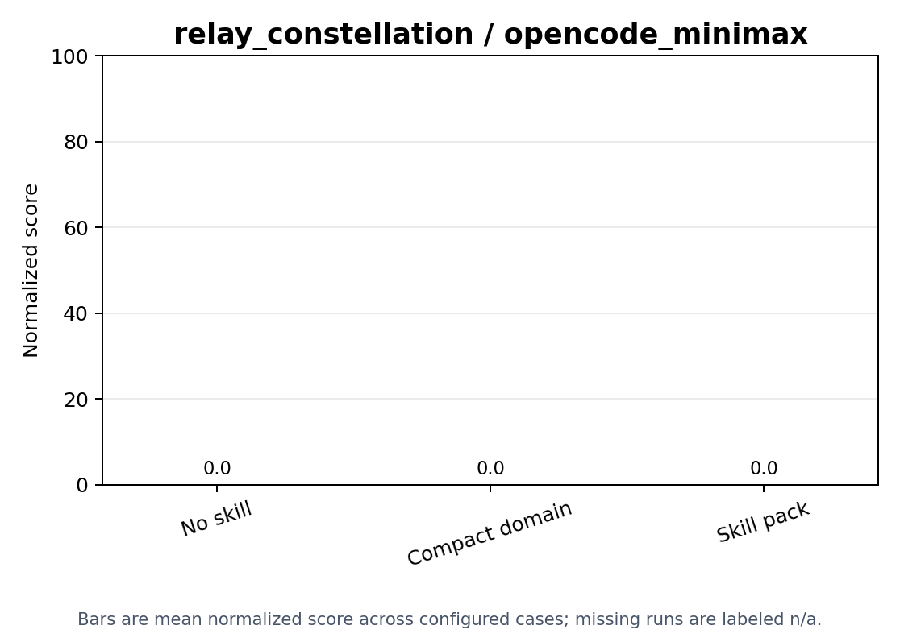

# Skill Injection

relay_constellation skill-ablation results across configured conditions and harnesses.

Generated from the current `skill_injection` aggregate artifacts.

## Score Plots

## Condition Summary

| Condition | Runs | Present | Valid | Valid Rate | Mean Service | Mean Worst Demand | Mean Added Satellites | Mean Latency | Mean P95 Latency | Mean Score | Overall Statuses |
| --- | ---: | ---: | ---: | ---: | ---: | ---: | ---: | ---: | ---: | ---: | ---: |
| compact_domain | 10 | 0 | 0 | 0.0000 | - | - | - | - | - | 0.0000 | missing_artifact: 10 |
| no_skill | 10 | 10 | 9 | 0.9000 | 0.2797 | 0.1800 | 6.9000 | 143.7 | 269.8 | 17.83 | success: 9, verifier_invalid: 1 |
| skill_pack | 10 | 0 | 0 | 0.0000 | - | - | - | - | - | 0.0000 | missing_artifact: 10 |

## Condition And Harness Summary

| Condition | Harness | Runs | Present | Valid | Valid Rate | Mean Service | Mean Worst Demand | Mean Added Satellites | Mean Latency | Mean P95 Latency | Mean Score | Overall Statuses |
| --- | --- | ---: | ---: | ---: | ---: | ---: | ---: | ---: | ---: | ---: | ---: | ---: |
| compact_domain | opencode_dpsk | 5 | 0 | 0 | 0.0000 | - | - | - | - | - | 0.0000 | missing_artifact: 5 |
| compact_domain | opencode_minimax | 5 | 0 | 0 | 0.0000 | - | - | - | - | - | 0.0000 | missing_artifact: 5 |
| no_skill | opencode_dpsk | 5 | 5 | 5 | 1.0000 | 0.5594 | 0.3600 | 8.4000 | 134.5 | 251.1 | 35.67 | success: 5 |
| no_skill | opencode_minimax | 5 | 5 | 4 | 0.8000 | 0.0000 | 0.0000 | 5.0000 | - | - | 0.0000 | success: 4, verifier_invalid: 1 |
| skill_pack | opencode_dpsk | 5 | 0 | 0 | 0.0000 | - | - | - | - | - | 0.0000 | missing_artifact: 5 |
| skill_pack | opencode_minimax | 5 | 0 | 0 | 0.0000 | - | - | - | - | - | 0.0000 | missing_artifact: 5 |

## Cases

| Condition | Harness | Split | Case | Artifact | Overall Status | Verifier Status | Valid | Duration (s) | Skills | Service | Worst Demand | Added Satellites | Latency | P95 Latency | Score |
| --- | --- | --- | --- | --- | --- | --- | --- | ---: | ---: | ---: | ---: | ---: | ---: | ---: | ---: |
| compact_domain | opencode_dpsk | test | case_0001 | missing_artifact | missing_artifact | missing_artifact | - | - | 1 | - | - | - | - | - | 0 |
| compact_domain | opencode_dpsk | test | case_0002 | missing_artifact | missing_artifact | missing_artifact | - | - | 1 | - | - | - | - | - | 0 |
| compact_domain | opencode_dpsk | test | case_0003 | missing_artifact | missing_artifact | missing_artifact | - | - | 1 | - | - | - | - | - | 0 |
| compact_domain | opencode_dpsk | test | case_0004 | missing_artifact | missing_artifact | missing_artifact | - | - | 1 | - | - | - | - | - | 0 |
| compact_domain | opencode_dpsk | test | case_0005 | missing_artifact | missing_artifact | missing_artifact | - | - | 1 | - | - | - | - | - | 0 |
| compact_domain | opencode_minimax | test | case_0001 | missing_artifact | missing_artifact | missing_artifact | - | - | 1 | - | - | - | - | - | 0 |
| compact_domain | opencode_minimax | test | case_0002 | missing_artifact | missing_artifact | missing_artifact | - | - | 1 | - | - | - | - | - | 0 |
| compact_domain | opencode_minimax | test | case_0003 | missing_artifact | missing_artifact | missing_artifact | - | - | 1 | - | - | - | - | - | 0 |
| compact_domain | opencode_minimax | test | case_0004 | missing_artifact | missing_artifact | missing_artifact | - | - | 1 | - | - | - | - | - | 0 |
| compact_domain | opencode_minimax | test | case_0005 | missing_artifact | missing_artifact | missing_artifact | - | - | 1 | - | - | - | - | - | 0 |
| no_skill | opencode_dpsk | test | case_0001 | present | success | valid | true | 6891.8 | 0 | 0.9222 | 0.5333 | 6 | 152.8 | 288.5 | 57.75 |
| no_skill | opencode_dpsk | test | case_0002 | present | success | valid | true | 4038.9 | 0 | 0.9524 | 0.6667 | 10 | 114.6 | 215.1 | 61.67 |
| no_skill | opencode_dpsk | test | case_0003 | present | success | valid | true | 7200.8 | 0 | 0 | 0 | 8 | - | - | 0 |
| no_skill | opencode_dpsk | test | case_0004 | present | success | valid | true | 4992.2 | 0 | 0.9222 | 0.6000 | 8 | 99.30 | 174.9 | 58.92 |
| no_skill | opencode_dpsk | test | case_0005 | present | success | valid | true | 7200.8 | 0 | 0 | 0 | 10 | - | - | 0 |
| no_skill | opencode_minimax | test | case_0001 | present | success | valid | true | 3344.4 | 0 | 0 | 0 | 6 | - | - | 0 |
| no_skill | opencode_minimax | test | case_0002 | present | success | valid | true | 2326.8 | 0 | 0 | 0 | 2 | - | - | 0 |
| no_skill | opencode_minimax | test | case_0003 | present | success | valid | true | 3290.8 | 0 | 0 | 0 | 8 | - | - | 0 |
| no_skill | opencode_minimax | test | case_0004 | present | verifier_invalid | invalid | false | 3532.6 | 0 | 0 | 0 | 8 | - | - | 0 |
| no_skill | opencode_minimax | test | case_0005 | present | success | valid | true | 2330.2 | 0 | 0 | 0 | 1 | - | - | 0 |
| skill_pack | opencode_dpsk | test | case_0001 | missing_artifact | missing_artifact | missing_artifact | - | - | 3 | - | - | - | - | - | 0 |
| skill_pack | opencode_dpsk | test | case_0002 | missing_artifact | missing_artifact | missing_artifact | - | - | 3 | - | - | - | - | - | 0 |
| skill_pack | opencode_dpsk | test | case_0003 | missing_artifact | missing_artifact | missing_artifact | - | - | 3 | - | - | - | - | - | 0 |
| skill_pack | opencode_dpsk | test | case_0004 | missing_artifact | missing_artifact | missing_artifact | - | - | 3 | - | - | - | - | - | 0 |
| skill_pack | opencode_dpsk | test | case_0005 | missing_artifact | missing_artifact | missing_artifact | - | - | 3 | - | - | - | - | - | 0 |
| skill_pack | opencode_minimax | test | case_0001 | missing_artifact | missing_artifact | missing_artifact | - | - | 3 | - | - | - | - | - | 0 |
| skill_pack | opencode_minimax | test | case_0002 | missing_artifact | missing_artifact | missing_artifact | - | - | 3 | - | - | - | - | - | 0 |
| skill_pack | opencode_minimax | test | case_0003 | missing_artifact | missing_artifact | missing_artifact | - | - | 3 | - | - | - | - | - | 0 |
| skill_pack | opencode_minimax | test | case_0004 | missing_artifact | missing_artifact | missing_artifact | - | - | 3 | - | - | - | - | - | 0 |
| skill_pack | opencode_minimax | test | case_0005 | missing_artifact | missing_artifact | missing_artifact | - | - | 3 | - | - | - | - | - | 0 |
