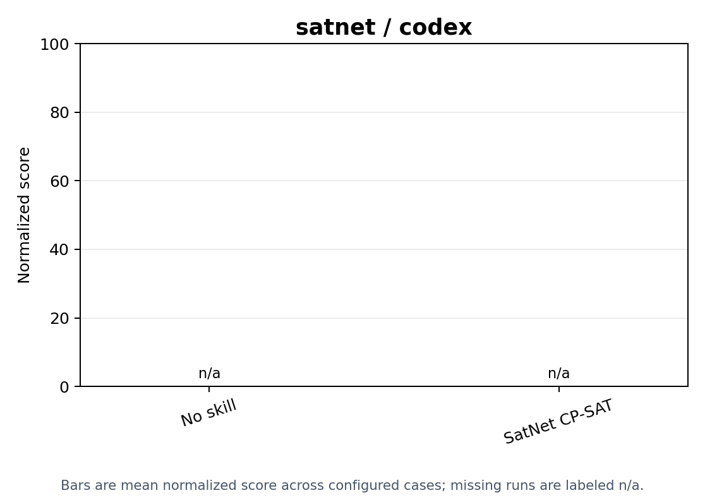

# Skill Injection

satnet skill-ablation results across configured conditions and harnesses.

Generated from the current `skill_injection` aggregate artifacts.

## Score Plots

## Condition Summary

| Condition | Runs | Present | Valid | Valid Rate | Mean Coverage | Mean Quality | Mean Hours | Mean U RMS | Mean U Max | Mean Score | Overall Statuses |
| --- | ---: | ---: | ---: | ---: | ---: | ---: | ---: | ---: | ---: | ---: | ---: |
| no_skill | 5 | 0 | 0 | - | - | - | - | - | - | - | missing_artifact: 5 |
| satnet_ortools_python | 5 | 0 | 0 | - | - | - | - | - | - | - | missing_artifact: 5 |

## Condition And Harness Summary

| Condition | Harness | Runs | Present | Valid | Valid Rate | Mean Coverage | Mean Quality | Mean Hours | Mean U RMS | Mean U Max | Mean Score | Overall Statuses |
| --- | --- | ---: | ---: | ---: | ---: | ---: | ---: | ---: | ---: | ---: | ---: | ---: |
| no_skill | codex | 5 | 0 | 0 | - | - | - | - | - | - | - | missing_artifact: 5 |
| satnet_ortools_python | codex | 5 | 0 | 0 | - | - | - | - | - | - | - | missing_artifact: 5 |

## Cases

| Condition | Harness | Split | Case | Artifact | Overall Status | Verifier Status | Valid | Duration (s) | Skills | Coverage | Quality | Hours | U RMS | U Max | Score |
| --- | --- | --- | --- | --- | --- | --- | --- | ---: | ---: | ---: | ---: | ---: | ---: | ---: | ---: |
| no_skill | codex | test | W10_2018 | missing_artifact | missing_artifact | missing_artifact | - | - | 0 | - | - | - | - | - | - |
| no_skill | codex | test | W20_2018 | missing_artifact | missing_artifact | missing_artifact | - | - | 0 | - | - | - | - | - | - |
| no_skill | codex | test | W30_2018 | missing_artifact | missing_artifact | missing_artifact | - | - | 0 | - | - | - | - | - | - |
| no_skill | codex | test | W40_2018 | missing_artifact | missing_artifact | missing_artifact | - | - | 0 | - | - | - | - | - | - |
| no_skill | codex | test | W50_2018 | missing_artifact | missing_artifact | missing_artifact | - | - | 0 | - | - | - | - | - | - |
| satnet_ortools_python | codex | test | W10_2018 | missing_artifact | missing_artifact | missing_artifact | - | - | 1 | - | - | - | - | - | - |
| satnet_ortools_python | codex | test | W20_2018 | missing_artifact | missing_artifact | missing_artifact | - | - | 1 | - | - | - | - | - | - |
| satnet_ortools_python | codex | test | W30_2018 | missing_artifact | missing_artifact | missing_artifact | - | - | 1 | - | - | - | - | - | - |
| satnet_ortools_python | codex | test | W40_2018 | missing_artifact | missing_artifact | missing_artifact | - | - | 1 | - | - | - | - | - | - |
| satnet_ortools_python | codex | test | W50_2018 | missing_artifact | missing_artifact | missing_artifact | - | - | 1 | - | - | - | - | - | - |
