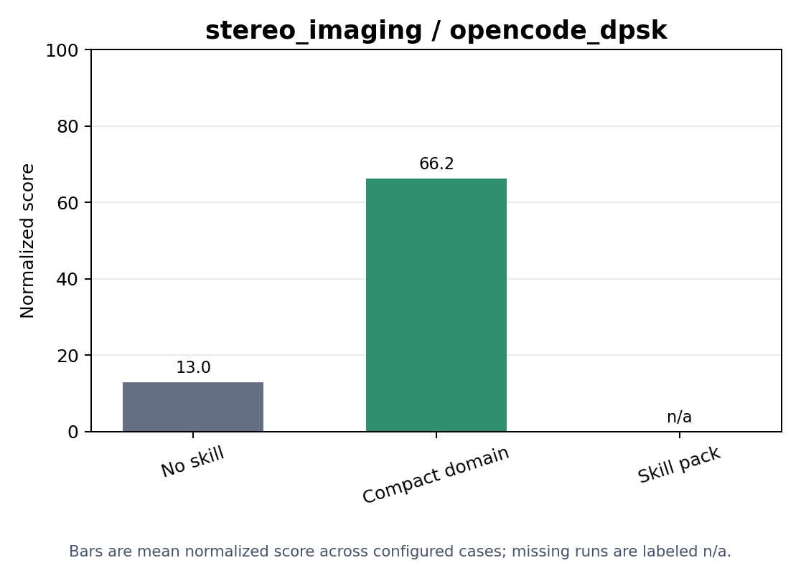
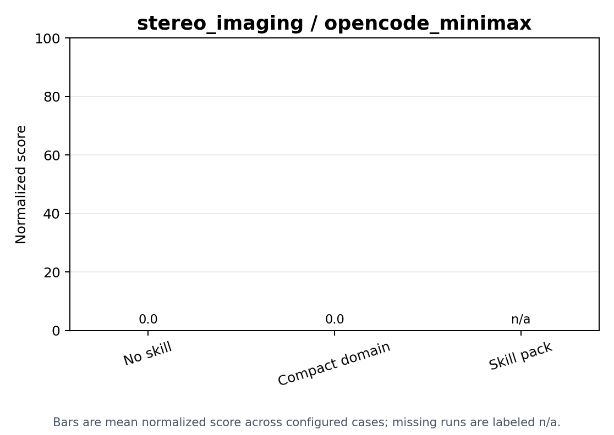

# Skill Injection

stereo_imaging skill-ablation results across configured conditions and harnesses.

Generated from the current `skill_injection` aggregate artifacts.

## Score Plots

## Condition Summary

| Condition | Runs | Present | Valid | Valid Rate | Mean Coverage | Mean Quality | Mean Hours | Mean U RMS | Mean U Max | Mean Score | Overall Statuses |
| --- | ---: | ---: | ---: | ---: | ---: | ---: | ---: | ---: | ---: | ---: | ---: |
| compact_domain | 10 | 3 | 3 | 1.0000 | 0.5099 | 0.4411 | - | - | - | 44.11 | missing_artifact: 7, success: 3 |
| no_skill | 10 | 10 | 5 | 0.7143 | 0.2491 | 0.1964 | - | - | - | 9.2822 | success: 5, verifier_error: 3, verifier_invalid: 2 |
| skill_pack | 10 | 0 | 0 | - | - | - | - | - | - | - | missing_artifact: 10 |

## Condition And Harness Summary

| Condition | Harness | Runs | Present | Valid | Valid Rate | Mean Coverage | Mean Quality | Mean Hours | Mean U RMS | Mean U Max | Mean Score | Overall Statuses |
| --- | --- | ---: | ---: | ---: | ---: | ---: | ---: | ---: | ---: | ---: | ---: | ---: |
| compact_domain | opencode_dpsk | 5 | 2 | 2 | 1.0000 | 0.7648 | 0.6617 | - | - | - | 66.17 | missing_artifact: 3, success: 2 |
| compact_domain | opencode_minimax | 5 | 1 | 1 | 1.0000 | 0.0000 | 0.0000 | - | - | - | 0.0000 | missing_artifact: 4, success: 1 |
| no_skill | opencode_dpsk | 5 | 5 | 4 | 0.8000 | 0.3487 | 0.2749 | - | - | - | 13.00 | success: 4, verifier_invalid: 1 |
| no_skill | opencode_minimax | 5 | 5 | 1 | 0.5000 | 0.0000 | 0.0000 | - | - | - | 0.0000 | success: 1, verifier_error: 3, verifier_invalid: 1 |
| skill_pack | opencode_dpsk | 5 | 0 | 0 | - | - | - | - | - | - | - | missing_artifact: 5 |
| skill_pack | opencode_minimax | 5 | 0 | 0 | - | - | - | - | - | - | - | missing_artifact: 5 |

## Cases

| Condition | Harness | Split | Case | Artifact | Overall Status | Verifier Status | Valid | Duration (s) | Skills | Coverage | Quality | Hours | U RMS | U Max | Score |
| --- | --- | --- | --- | --- | --- | --- | --- | ---: | ---: | ---: | ---: | ---: | ---: | ---: | ---: |
| compact_domain | opencode_dpsk | test | case_0001 | missing_artifact | missing_artifact | missing_artifact | - | - | 1 | - | - | - | - | - | - |
| compact_domain | opencode_dpsk | test | case_0002 | present | success | valid | true | 3623.0 | 1 | 0.9835 | 0.9032 | - | - | - | 90.32 |
| compact_domain | opencode_dpsk | test | case_0003 | missing_artifact | missing_artifact | missing_artifact | - | - | 1 | - | - | - | - | - | - |
| compact_domain | opencode_dpsk | test | case_0004 | missing_artifact | missing_artifact | missing_artifact | - | - | 1 | - | - | - | - | - | - |
| compact_domain | opencode_dpsk | test | case_0005 | present | success | valid | true | 6371.9 | 1 | 0.5461 | 0.4201 | - | - | - | 42.01 |
| compact_domain | opencode_minimax | test | case_0001 | present | success | valid | true | 4280.2 | 1 | 0 | 0 | - | - | - | 0 |
| compact_domain | opencode_minimax | test | case_0002 | missing_artifact | missing_artifact | missing_artifact | - | - | 1 | - | - | - | - | - | - |
| compact_domain | opencode_minimax | test | case_0003 | missing_artifact | missing_artifact | missing_artifact | - | - | 1 | - | - | - | - | - | - |
| compact_domain | opencode_minimax | test | case_0004 | missing_artifact | missing_artifact | missing_artifact | - | - | 1 | - | - | - | - | - | - |
| compact_domain | opencode_minimax | test | case_0005 | missing_artifact | missing_artifact | missing_artifact | - | - | 1 | - | - | - | - | - | - |
| no_skill | opencode_dpsk | test | case_0001 | present | success | valid | true | 5879.5 | 0 | 0 | 0 | - | - | - | 0 |
| no_skill | opencode_dpsk | test | case_0002 | present | success | valid | true | 7200.9 | 0 | 0 | 0 | - | - | - | 0 |
| no_skill | opencode_dpsk | test | case_0003 | present | success | valid | true | 5456.1 | 0 | 0.9421 | 0.6498 | - | - | - | 64.98 |
| no_skill | opencode_dpsk | test | case_0004 | present | verifier_invalid | invalid | false | 5591.7 | 0 | 0.8016 | 0.7248 | - | - | - | 0 |
| no_skill | opencode_dpsk | test | case_0005 | present | success | valid | true | 5857.2 | 0 | 0 | 0 | - | - | - | 0 |
| no_skill | opencode_minimax | test | case_0001 | present | success | valid | true | 6512.8 | 0 | 0 | 0 | - | - | - | 0 |
| no_skill | opencode_minimax | test | case_0002 | present | verifier_error | error | - | 864.1 | 0 | - | - | - | - | - | - |
| no_skill | opencode_minimax | test | case_0003 | present | verifier_error | error | - | 4550.7 | 0 | - | - | - | - | - | - |
| no_skill | opencode_minimax | test | case_0004 | present | verifier_error | error | - | 717.0 | 0 | - | - | - | - | - | - |
| no_skill | opencode_minimax | test | case_0005 | present | verifier_invalid | invalid | false | 3852.3 | 0 | 0 | 0 | - | - | - | 0 |
| skill_pack | opencode_dpsk | test | case_0001 | missing_artifact | missing_artifact | missing_artifact | - | - | 4 | - | - | - | - | - | - |
| skill_pack | opencode_dpsk | test | case_0002 | missing_artifact | missing_artifact | missing_artifact | - | - | 4 | - | - | - | - | - | - |
| skill_pack | opencode_dpsk | test | case_0003 | missing_artifact | missing_artifact | missing_artifact | - | - | 4 | - | - | - | - | - | - |
| skill_pack | opencode_dpsk | test | case_0004 | missing_artifact | missing_artifact | missing_artifact | - | - | 4 | - | - | - | - | - | - |
| skill_pack | opencode_dpsk | test | case_0005 | missing_artifact | missing_artifact | missing_artifact | - | - | 4 | - | - | - | - | - | - |
| skill_pack | opencode_minimax | test | case_0001 | missing_artifact | missing_artifact | missing_artifact | - | - | 4 | - | - | - | - | - | - |
| skill_pack | opencode_minimax | test | case_0002 | missing_artifact | missing_artifact | missing_artifact | - | - | 4 | - | - | - | - | - | - |
| skill_pack | opencode_minimax | test | case_0003 | missing_artifact | missing_artifact | missing_artifact | - | - | 4 | - | - | - | - | - | - |
| skill_pack | opencode_minimax | test | case_0004 | missing_artifact | missing_artifact | missing_artifact | - | - | 4 | - | - | - | - | - | - |
| skill_pack | opencode_minimax | test | case_0005 | missing_artifact | missing_artifact | missing_artifact | - | - | 4 | - | - | - | - | - | - |
